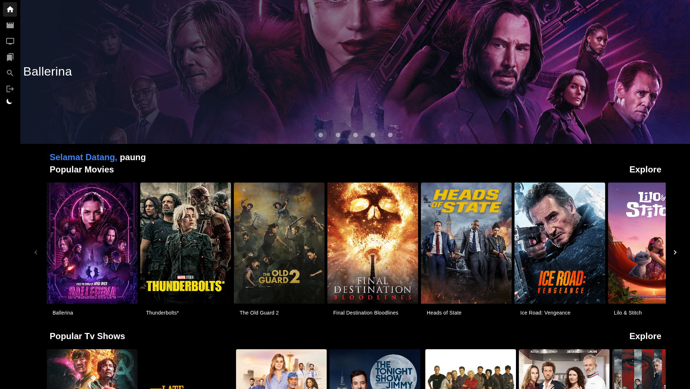
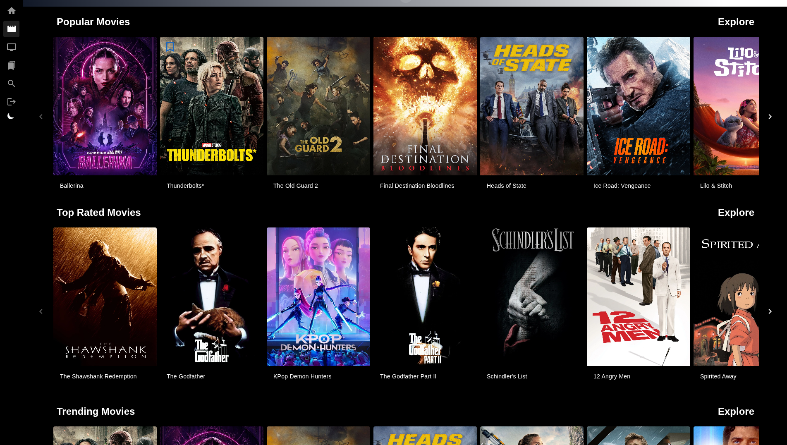
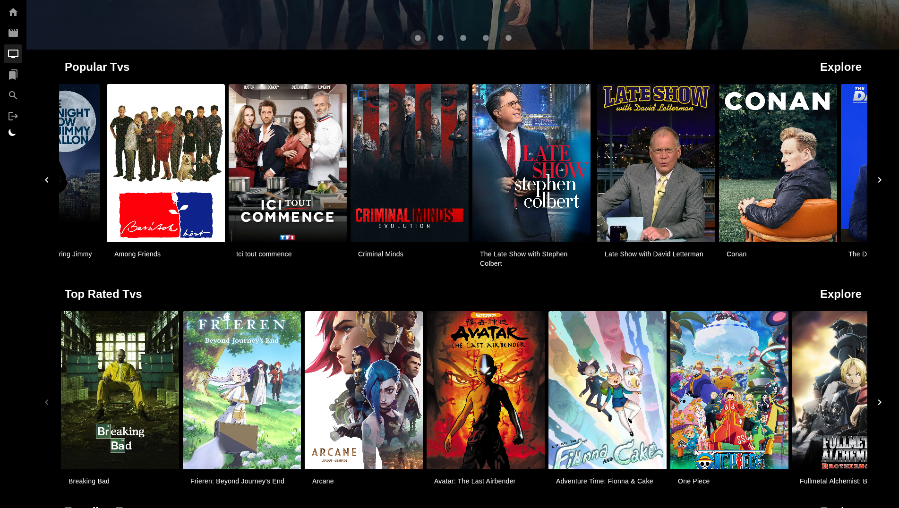
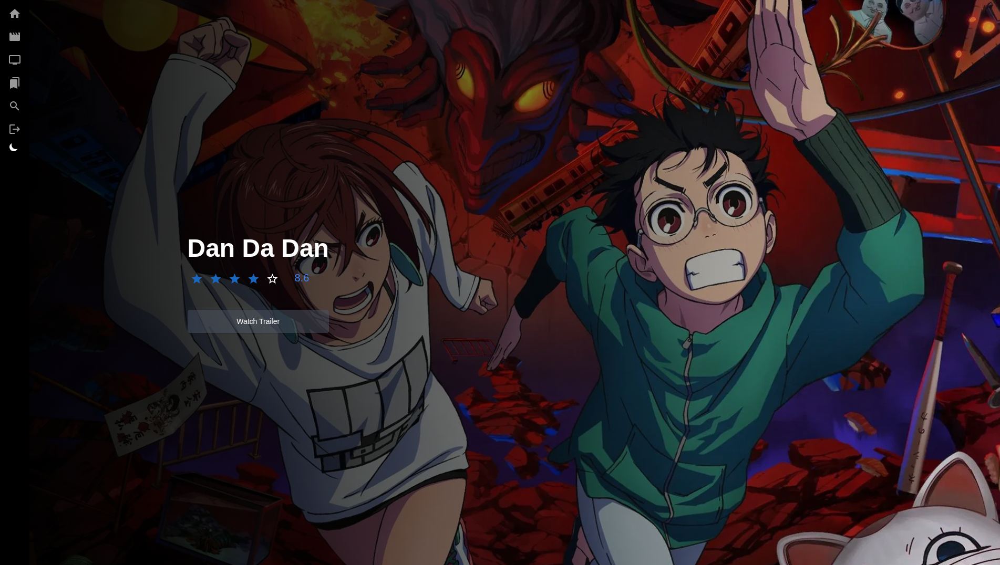
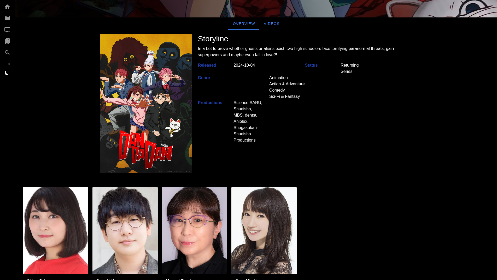
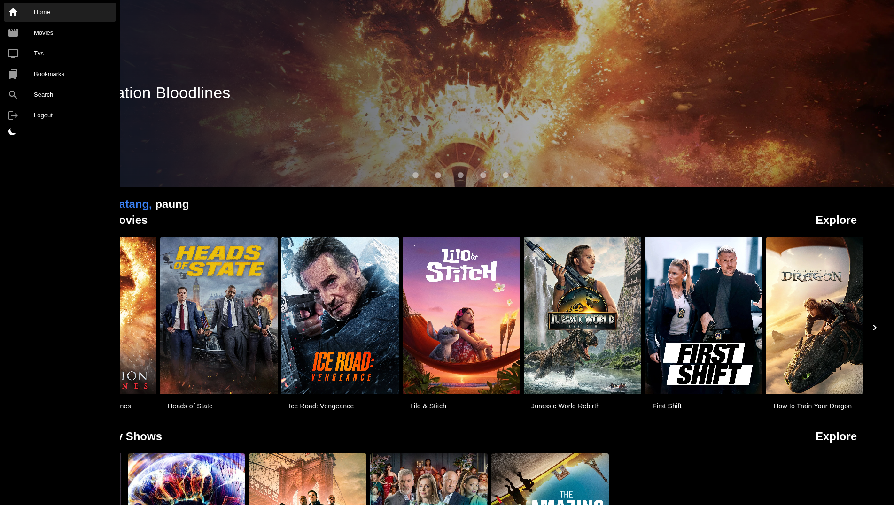
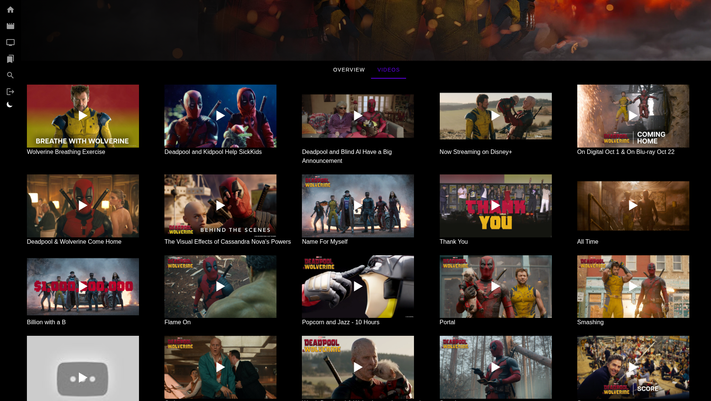

# 🎬 Movies & TV Shows Web App

A  Movies & TV Shows website built with a **Laravel-powered API backend** and a **frontend client (NuxtJS)**. This project fetches content from the third-party [TMDB API](https://www.themoviedb.org/documentation/api), allowing users to browse, view details, and bookmark their favorite movies and TV shows.

## 🌟 Features

- ✅ Browse Popular, Top Rated, and Trending Movies & TV Shows
- 🔍 Search Movies and TV content using keywords
- 📄 View detailed information about each title (description, cast, trailer, etc.)
- ⭐ Bookmark your favorite Movies and TV Shows (requires login)
- 👤 User authentication (register, login, logout)
- 📦 RESTful API built with Laravel (uses TMDB as third-party data source)

---

## 🛠️ Tech Stack

### [Backend (API)](https://github.com/asfung/pilm-tipi)
- **Laravel 10**
- **TMDB API integration**
- **PostgreSQL** (for users and bookmarks)

### Frontend (Client)
- **Vue.js 3 & Nuxt.js 3** 
- **TailwindCSS** for styling
- **Axios** or **Fetch API** for consuming backend
- **[Pinia](https://pinia.vuejs.org/)** State Management

---

<!-- ## 🔗 API Overview -->
<!---->
<!-- ### TMDB Integration -->
<!-- - `/api/movies/popular` -->
<!-- - `/api/tv/top-rated` -->
<!-- - `/api/search?query=...` -->
<!-- - `/api/details/{id}` -->
<!---->
<!-- ### User & Bookmarks -->
<!-- - `POST /api/register` -->
<!-- - `POST /api/login` -->
<!-- - `GET /api/bookmarks` – Get all user bookmarks -->
<!-- - `POST /api/bookmarks/{id}` – Add to bookmarks -->
<!-- - `DELETE /api/bookmarks/{id}` – Remove from bookmarks -->
<!---->
<!-- --- -->

## 📌 Bookmark Feature

Users can save movies or TV shows to their personal bookmark list. This list is stored in your database and tied to the user's account.

- Requires authentication
- Supports both Movie and TV types
- Simple UI for toggling bookmarks on/off

---

## 🔐 User Authentication

- Secure registration and login system using JWT
- Authenticated endpoints protected by middleware
- Frontend includes login and register pages

---

## 🖼️ Screenshots

<div align="center">
  <h4>🏠 Home Page</h4>
  
</div>

<br />

<div align="center">
  <table>
    <tr>
      <td align="center">
        <h4>🔥 Movies List</h4>
        
      </td>
      <td align="center">
        <h4>📺 TVs List</h4>
        
      </td>
    </tr>
    <tr>
      <td align="center">
        <h4>🎬 Detail Page</h4>
        
      </td>
      <td align="center">
        <h4>🎬 Detail Page</h4>
        
      </td>
    </tr>
    <tr>
      <td align="center">
        
      </td>
      <td align="center">
        
      </td>
    </tr>
  </table>
</div>

---


<!-- ## 🚀 Getting Started -->
<!---->
<!-- ### Prerequisites -->
<!---->
<!-- - PHP 8.2+ -->
<!-- - Composer -->
<!-- - Node.js & npm/yarn (for frontend) -->
<!-- - Laravel CLI -->
<!-- - MySQL/PostgreSQL -->
<!---->
<!-- ### Backend Setup -->
<!---->
<!-- ```bash -->
<!-- git clone https://github.com/yourusername/movies-api.git -->
<!-- cd movies-api -->
<!-- composer install -->
<!-- cp .env.example .env -->
<!-- php artisan key:generate -->
<!-- php artisan migrate -->
<!-- php artisan serve -->
<!---->

Paung, Author
